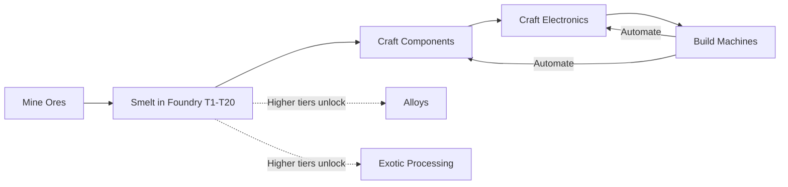

# Ore Progression System Overhaul v4

## Overview

Complete replacement of the ore, component, smelting, and crafting systems:
- **100 ores** across 7 rarity tiers
- **100 components** across 7 tiers
- **20-tier smelter progression** replacing the current 3-tier foundry
- **Updated electronics** using new components
- **Machine automation** system
- Crafting chain: **Ores -> Smelt -> Ingots -> Components -> Electronics -> Machines**

---

## Crafting Pipeline



---

## Part A: Ores (100 total)

### Type Changes in `src/data/ores.ts`

```typescript
export type OreRarity = 'common' | 'uncommon' | 'rare' | 'epic' | 'legendary' | 'mythic' | 'exotic';

export interface Ore {
  id: string;
  name: string;
  tier: number;
  rarity: OreRarity;
  miningChance: number;
  smeltYield: number;
  refineMultiplier: number;
  refineCost: number;
  value: number;
  hardness: 'low' | 'medium' | 'high' | 'extreme';
  processingDifficulty: 'easy' | 'moderate' | 'expensive' | 'extreme';
  minSmeltTier: number;  // minimum foundry tier required to smelt this ore
}

export const RARITY_ORDER: OreRarity[] = [
  'common', 'uncommon', 'rare', 'epic', 'legendary', 'mythic', 'exotic'
];
```

Remove ALL generator code. Replace with a single explicit `ALL_ORES` array.

### Common (Tier 1) -- 20 ores -- minSmeltTier: 1
| # | ID | Name | miningChance | smeltYield | refMult | refCost | value | hardness | processing |
|---|-----|------|-------------|------------|---------|---------|-------|----------|------------|
| 1 | stone | Stone | 0.30 | 1 | 1.2 | 2 | 1 | low | easy |
| 2 | coal | Coal | 0.28 | 1 | 1.3 | 3 | 2 | low | easy |
| 3 | iron | Iron Ore | 0.25 | 2 | 1.5 | 5 | 3 | low | easy |
| 4 | copper | Copper Ore | 0.24 | 2 | 1.5 | 5 | 4 | low | easy |
| 5 | tin | Tin Ore | 0.22 | 2 | 1.4 | 6 | 4 | low | easy |
| 6 | aluminum | Aluminum Ore | 0.20 | 2 | 1.5 | 7 | 5 | low | easy |
| 7 | lead | Lead Ore | 0.20 | 2 | 1.4 | 5 | 3 | low | easy |
| 8 | zinc | Zinc Ore | 0.19 | 2 | 1.4 | 6 | 4 | low | easy |
| 9 | nickel | Nickel Ore | 0.18 | 2 | 1.4 | 7 | 5 | low | easy |
| 10 | bauxite | Bauxite | 0.18 | 1 | 1.3 | 5 | 4 | low | easy |
| 11 | sandstone | Sandstone | 0.17 | 1 | 1.2 | 3 | 2 | low | easy |
| 12 | limestone | Limestone | 0.17 | 1 | 1.2 | 3 | 2 | low | easy |
| 13 | clay | Clay | 0.16 | 1 | 1.2 | 2 | 2 | low | easy |
| 14 | gypsum | Gypsum | 0.16 | 1 | 1.2 | 3 | 2 | low | easy |
| 15 | chalk | Chalk | 0.15 | 1 | 1.1 | 2 | 1 | low | easy |
| 16 | gravel | Gravel | 0.15 | 1 | 1.1 | 2 | 1 | low | easy |
| 17 | basalt | Basalt | 0.14 | 1 | 1.3 | 4 | 3 | medium | easy |
| 18 | granite | Granite | 0.14 | 1 | 1.3 | 4 | 3 | medium | easy |
| 19 | diorite | Diorite | 0.13 | 1 | 1.2 | 3 | 2 | medium | easy |
| 20 | andesite | Andesite | 0.13 | 1 | 1.2 | 3 | 2 | medium | easy |

### Uncommon (Tier 2) -- 20 ores -- minSmeltTier: 3
| # | ID | Name | miningChance | smeltYield | refMult | refCost | value | hardness | processing |
|---|-----|------|-------------|------------|---------|---------|-------|----------|------------|
| 21 | quartz | Quartz | 0.10 | 1 | 1.6 | 8 | 6 | medium | moderate |
| 22 | feldspar | Feldspar | 0.10 | 1 | 1.4 | 7 | 5 | medium | moderate |
| 23 | mica | Mica | 0.09 | 1 | 1.5 | 8 | 6 | medium | moderate |
| 24 | sulfur | Sulfur | 0.09 | 1 | 1.4 | 7 | 5 | medium | moderate |
| 25 | graphite | Graphite | 0.09 | 1 | 1.5 | 8 | 7 | medium | moderate |
| 26 | fluorite | Fluorite | 0.08 | 1 | 1.5 | 9 | 7 | medium | moderate |
| 27 | calcite | Calcite | 0.08 | 1 | 1.4 | 7 | 5 | medium | moderate |
| 28 | dolomite | Dolomite | 0.08 | 1 | 1.4 | 7 | 5 | medium | moderate |
| 29 | magnetite | Magnetite | 0.07 | 1 | 1.6 | 10 | 8 | medium | moderate |
| 30 | hematite | Hematite | 0.07 | 1 | 1.5 | 9 | 7 | medium | moderate |
| 31 | chromite | Chromite | 0.07 | 1 | 1.5 | 10 | 8 | medium | moderate |
| 32 | ilmenite | Ilmenite | 0.06 | 1 | 1.5 | 10 | 8 | medium | moderate |
| 33 | rutile | Rutile | 0.06 | 1 | 1.6 | 11 | 9 | medium | moderate |
| 34 | pyrite | Pyrite | 0.06 | 1 | 1.5 | 9 | 8 | medium | moderate |
| 35 | galena | Galena | 0.06 | 1 | 1.5 | 9 | 7 | medium | moderate |
| 36 | sphalerite | Sphalerite | 0.05 | 1 | 1.5 | 10 | 8 | medium | moderate |
| 37 | talc | Talc | 0.05 | 1 | 1.3 | 6 | 5 | low | moderate |
| 38 | kaolinite | Kaolinite | 0.05 | 1 | 1.4 | 7 | 6 | low | moderate |
| 39 | barite | Barite | 0.05 | 1 | 1.5 | 9 | 7 | medium | moderate |
| 40 | halite | Halite | 0.05 | 1 | 1.3 | 6 | 5 | low | moderate |

### Rare (Tier 3) -- 20 ores -- minSmeltTier: 5
| # | ID | Name | miningChance | smeltYield | refMult | refCost | value | hardness | processing |
|---|-----|------|-------------|------------|---------|---------|-------|----------|------------|
| 41 | silver | Silver Ore | 0.04 | 1 | 1.8 | 15 | 15 | medium | moderate |
| 42 | gold | Gold Ore | 0.03 | 1 | 2.0 | 30 | 40 | medium | moderate |
| 43 | platinum | Platinum Ore | 0.025 | 1 | 2.0 | 50 | 60 | high | expensive |
| 44 | palladium | Palladium Ore | 0.024 | 1 | 2.0 | 45 | 55 | high | expensive |
| 45 | cobalt | Cobalt Ore | 0.023 | 1 | 1.8 | 35 | 30 | high | expensive |
| 46 | lithium | Lithium Ore | 0.022 | 1 | 1.7 | 25 | 25 | medium | moderate |
| 47 | tungsten | Tungsten Ore | 0.020 | 1 | 1.9 | 40 | 45 | high | expensive |
| 48 | molybdenum | Molybdenum Ore | 0.019 | 1 | 1.8 | 35 | 35 | high | expensive |
| 49 | vanadium | Vanadium Ore | 0.018 | 1 | 1.7 | 30 | 28 | high | moderate |
| 50 | beryllium | Beryllium Ore | 0.017 | 1 | 1.8 | 35 | 32 | high | expensive |
| 51 | strontium | Strontium Ore | 0.016 | 1 | 1.6 | 25 | 22 | medium | moderate |
| 52 | zirconium | Zirconium Ore | 0.015 | 1 | 1.7 | 30 | 28 | high | expensive |
| 53 | niobium | Niobium Ore | 0.014 | 1 | 1.8 | 35 | 35 | high | expensive |
| 54 | tantalum | Tantalum Ore | 0.013 | 1 | 1.9 | 40 | 42 | high | expensive |
| 55 | arsenopyrite | Arsenopyrite | 0.012 | 1 | 1.6 | 20 | 18 | medium | moderate |
| 56 | realgar | Realgar | 0.012 | 1 | 1.5 | 18 | 16 | medium | moderate |
| 57 | orpiment | Orpiment | 0.011 | 1 | 1.5 | 18 | 16 | medium | moderate |
| 58 | pitchblende | Pitchblende | 0.010 | 1 | 2.0 | 50 | 50 | high | expensive |
| 59 | cassiterite | Cassiterite | 0.010 | 1 | 1.7 | 25 | 20 | medium | moderate |
| 60 | bornite | Bornite | 0.010 | 1 | 1.6 | 22 | 18 | medium | moderate |

### Epic (Tier 4) -- 15 ores -- minSmeltTier: 9
| # | ID | Name | miningChance | smeltYield | refMult | refCost | value | hardness | processing |
|---|-----|------|-------------|------------|---------|---------|-------|----------|------------|
| 61 | titanium | Titanium Ore | 0.008 | 1 | 1.7 | 20 | 20 | high | expensive |
| 62 | iridium | Iridium Ore | 0.007 | 1 | 2.2 | 60 | 80 | extreme | extreme |
| 63 | osmium | Osmium Ore | 0.007 | 1 | 2.1 | 55 | 75 | extreme | extreme |
| 64 | rhodium | Rhodium Ore | 0.006 | 1 | 2.2 | 60 | 85 | extreme | extreme |
| 65 | ruthenium_ore | Ruthenium Ore | 0.006 | 1 | 2.0 | 50 | 70 | high | expensive |
| 66 | thorium | Thorium Ore | 0.005 | 1 | 2.3 | 70 | 90 | high | expensive |
| 67 | uraninite | Uraninite | 0.005 | 1 | 2.5 | 80 | 100 | high | extreme |
| 68 | columbite | Columbite | 0.005 | 1 | 1.8 | 40 | 50 | high | expensive |
| 69 | monazite | Monazite | 0.004 | 1 | 2.0 | 55 | 65 | high | expensive |
| 70 | xenotime | Xenotime | 0.004 | 1 | 2.0 | 55 | 65 | high | expensive |
| 71 | spodumene | Spodumene | 0.004 | 1 | 1.8 | 45 | 55 | high | expensive |
| 72 | lepidolite | Lepidolite | 0.004 | 1 | 1.7 | 40 | 48 | medium | expensive |
| 73 | petalite | Petalite | 0.003 | 1 | 1.7 | 42 | 50 | medium | expensive |
| 74 | amblygonite | Amblygonite | 0.003 | 1 | 1.8 | 45 | 52 | high | expensive |
| 75 | pollucite | Pollucite | 0.003 | 1 | 1.9 | 50 | 58 | high | expensive |

### Legendary (Tier 5) -- 10 ores -- minSmeltTier: 13
| # | ID | Name | miningChance | smeltYield | refMult | refCost | value | hardness | processing |
|---|-----|------|-------------|------------|---------|---------|-------|----------|------------|
| 76 | diamond | Diamond Ore | 0.002 | 1 | 2.5 | 100 | 200 | extreme | extreme |
| 77 | emerald | Emerald Ore | 0.002 | 1 | 2.3 | 90 | 180 | extreme | extreme |
| 78 | ruby | Ruby Ore | 0.0018 | 1 | 2.3 | 90 | 180 | extreme | extreme |
| 79 | sapphire | Sapphire Ore | 0.0018 | 1 | 2.3 | 90 | 175 | extreme | extreme |
| 80 | alexandrite | Alexandrite Ore | 0.0015 | 1 | 2.5 | 110 | 220 | extreme | extreme |
| 81 | painite | Painite | 0.0012 | 1 | 2.8 | 130 | 280 | extreme | extreme |
| 82 | benitoite | Benitoite | 0.0012 | 1 | 2.6 | 120 | 250 | extreme | extreme |
| 83 | taaffeite | Taaffeite | 0.0010 | 1 | 2.8 | 140 | 300 | extreme | extreme |
| 84 | red_beryl | Red Beryl | 0.0010 | 1 | 2.7 | 135 | 290 | extreme | extreme |
| 85 | grandidierite | Grandidierite | 0.0008 | 1 | 3.0 | 150 | 350 | extreme | extreme |

### Mythic (Tier 6) -- 10 ores -- minSmeltTier: 15
| # | ID | Name | miningChance | smeltYield | refMult | refCost | value | hardness | processing |
|---|-----|------|-------------|------------|---------|---------|-------|----------|------------|
| 86 | californium | Californium Ore | 0.0006 | 1 | 3.0 | 200 | 500 | extreme | extreme |
| 87 | neptunium | Neptunium Ore | 0.0006 | 1 | 3.0 | 200 | 480 | extreme | extreme |
| 88 | plutonium | Plutonium Ore | 0.0005 | 1 | 3.2 | 220 | 550 | extreme | extreme |
| 89 | francium | Francium Trace Ore | 0.0004 | 1 | 3.5 | 250 | 600 | extreme | extreme |
| 90 | actinium | Actinium Ore | 0.0004 | 1 | 3.0 | 200 | 480 | extreme | extreme |
| 91 | protactinium | Protactinium Ore | 0.0004 | 1 | 3.0 | 210 | 500 | extreme | extreme |
| 92 | scandium | Scandium Ore | 0.0003 | 1 | 2.8 | 180 | 420 | extreme | extreme |
| 93 | yttrium | Yttrium Ore | 0.0003 | 1 | 2.8 | 180 | 420 | extreme | extreme |
| 94 | lanthanum | Lanthanum Ore | 0.0003 | 1 | 2.8 | 180 | 400 | extreme | extreme |
| 95 | cerium | Cerium Ore | 0.0003 | 1 | 2.8 | 175 | 380 | extreme | extreme |

### Exotic / Crystalix (Tier 7) -- 5 ores -- minSmeltTier: 17
| # | ID | Name | miningChance | smeltYield | refMult | refCost | value | hardness | processing |
|---|-----|------|-------------|------------|---------|---------|-------|----------|------------|
| 96 | veinite | Veinite | 0.0002 | 1 | 4.0 | 300 | 800 | extreme | extreme |
| 97 | void_crystal | Void Crystal | 0.00015 | 1 | 4.0 | 350 | 1000 | extreme | extreme |
| 98 | dark_matter | Dark Matter Residue | 0.0001 | 1 | 5.0 | 400 | 1500 | extreme | extreme |
| 99 | entropy_shard | Entropy Shard | 0.00008 | 1 | 5.0 | 450 | 2000 | extreme | extreme |
| 100 | singularity | Singularity Core Fragment | 0.00005 | 1 | 6.0 | 500 | 3000 | extreme | extreme |

---

## Part B: 20-Tier Smelter Progression

Replaces the current 3-tier `FOUNDRY_TIERS` array in `src/data/recipes.ts`.

### Updated FoundryUpgrade Interface

```typescript
export interface FoundryUpgrade {
  id: string;
  name: string;
  tier: number;
  cost: { itemId: string; type: 'ingot' | 'item' | 'currency'; quantity: number }[];
  slots: number;
  speedMultiplier: number;
  canAlloy: boolean;          // can combine ores into alloys
  automationSupport: boolean; // can be automated by machines
  description: string;
}
```

### Full 20-Tier Table

| Tier | ID | Name | Slots | Speed | Alloy | Auto | Upgrade Cost |
|------|-----|------|-------|-------|-------|------|-------------|
| 1 | electric_furnace_1 | Electric Furnace I | 1 | 1.0x | No | No | Free / starter |
| 2 | electric_furnace_2 | Electric Furnace II | 2 | 1.3x | No | No | 500 currency, iron ingot x20, copper ingot x15 |
| 3 | alloy_furnace_1 | Electric Alloy Furnace I | 2 | 1.5x | Yes | No | 1500 currency, tin ingot x20, zinc ingot x15, nickel ingot x10 |
| 4 | alloy_furnace_2 | Electric Alloy Furnace II | 3 | 1.8x | Yes | No | 3000 currency, aluminum ingot x25, quartz ingot x10 |
| 5 | industrial_smelter_1 | Industrial Electric Smelter I | 3 | 2.2x | Yes | No | 6000 currency, silver ingot x10, magnetite ingot x15 |
| 6 | industrial_smelter_2 | Industrial Electric Smelter II | 4 | 2.5x | Yes | Yes | 10000 currency, gold ingot x5, chromite ingot x10, gear_assembly x2 |
| 7 | precision_smelter_1 | Precision Electric Smelter I | 4 | 3.0x | Yes | Yes | 18000 currency, platinum ingot x5, cobalt ingot x8, compact_gearbox x1 |
| 8 | precision_smelter_2 | Precision Electric Smelter II | 5 | 3.5x | Yes | Yes | 30000 currency, tungsten ingot x8, lithium ingot x5, stabilizer_unit x1 |
| 9 | advanced_furnace_1 | Advanced Electric Furnace I | 5 | 4.0x | Yes | Yes | 50000 currency, titanium ingot x10, molybdenum ingot x5, modular_frame x1 |
| 10 | advanced_furnace_2 | Advanced Electric Furnace II | 6 | 4.5x | Yes | Yes | 80000 currency, tantalum ingot x5, niobium ingot x5, structural_core x1 |
| 11 | plasma_smelter_1 | Plasma Electric Smelter I | 6 | 5.5x | Yes | Yes | 120000 currency, iridium ingot x3, osmium ingot x3, heavy_frame x1 |
| 12 | plasma_smelter_2 | Plasma Electric Smelter II | 7 | 6.5x | Yes | Yes | 180000 currency, rhodium ingot x3, thorium ingot x3, cooling_assembly x2 |
| 13 | nano_smelter_1 | Nano Electric Smelter I | 7 | 8.0x | Yes | Yes | 300000 currency, diamond ingot x2, emerald ingot x2, nano_frame x1 |
| 14 | nano_smelter_2 | Nano Electric Smelter II | 8 | 10.0x | Yes | Yes | 500000 currency, ruby ingot x2, sapphire ingot x2, precision_matrix x1 |
| 15 | fusion_smelter_1 | Fusion Electric Smelter I | 8 | 12.0x | Yes | Yes | 800000 currency, painite ingot x1, taaffeite ingot x1, energy_channel_core x1 |
| 16 | fusion_smelter_2 | Fusion Electric Smelter II | 10 | 15.0x | Yes | Yes | 1200000 currency, grandidierite ingot x1, californium ingot x1, fusion_housing x1 |
| 17 | void_smelter_1 | Void Electric Smelter I | 10 | 18.0x | Yes | Yes | 2000000 currency, veinite ingot x1, void_crystal ingot x1, quantum_frame x1 |
| 18 | void_smelter_2 | Void Electric Smelter II | 12 | 22.0x | Yes | Yes | 3500000 currency, dark_matter ingot x1, dimensional_coupler x1 |
| 19 | entropy_smelter | Entropy Electric Smelter | 14 | 28.0x | Yes | Yes | 6000000 currency, entropy_shard ingot x1, reality_stabilizer x1 |
| 20 | singularity_smelter | Solar Singularity Smelter | 20 | 50.0x | Yes | Yes | 10000000 currency, singularity ingot x1, singularity_chassis x1, temporal_stabilizer x1 |

### Smelter Tier -> Ore Tier Gating

The `minSmeltTier` field on each ore determines which foundry tier is needed:

| Ore Rarity | minSmeltTier | Unlocked At Smelter |
|-----------|-------------|-------------------|
| Common | 1 | Electric Furnace I |
| Uncommon | 3 | Electric Alloy Furnace I |
| Rare | 5 | Industrial Electric Smelter I |
| Epic | 9 | Advanced Electric Furnace I |
| Legendary | 13 | Nano Electric Smelter I |
| Mythic | 15 | Fusion Electric Smelter I |
| Exotic | 17 | Void Electric Smelter I |

### Smelter Special Capabilities

**Alloy Support (Tier 3+)**: A new `ALLOY_SMELT` action allows combining two ore types into an alloy ingot. The foundry UI gets an "Alloy Mode" toggle when `canAlloy` is true. Example alloys:
- Bronze: copper + tin
- Brass: copper + zinc
- Steel: iron + coal
- Nickel Steel: iron + nickel

**Automation Support (Tier 6+)**: When `automationSupport` is true and a machine is assigned to the foundry, it auto-queues smelting jobs when slots are available and raw ores exist in inventory.

### Smelting Speed Formula

```
actualDuration = baseDuration / (foundry.speedMultiplier * processingDifficultyFactor)
```

Where `processingDifficultyFactor`:
- easy: 1.0
- moderate: 0.7
- expensive: 0.4
- extreme: 0.2

So harder ores take longer even at the same foundry tier.

### Foundry Code Changes

In `src/hooks/useGameState.tsx`:

**START_SMELT action**: Add check `ore.minSmeltTier <= state.foundryTier`; reject if foundry tier is too low.

**New ALLOY_SMELT action**:
```typescript
| { type: 'ALLOY_SMELT'; oreId1: string; oreId2: string; refined1: boolean; refined2: boolean }
```
Only available when `getCurrentFoundry(state).canAlloy === true`.

---

## Part C: Components (100 total)

All components are crafted from **ingots**. Higher-tier components also require lower-tier components. Components feed into electronics.

### Tier 1 -- Basic Parts (1-15)
Made from Common ore ingots: iron, copper, tin, aluminum, lead, zinc, nickel

| # | ID | Name | Ingredients | Out | Description |
|---|-----|------|------------|-----|-------------|
| 1 | metal_plate | Metal Plate | iron x3 | 4 | Flat iron sheet |
| 2 | reinforced_plate | Reinforced Plate | iron x2, nickel x1 | 2 | Hardened plate |
| 3 | metal_rod | Metal Rod | iron x2 | 4 | Solid iron rod |
| 4 | metal_beam | Metal Beam | iron x4, zinc x1 | 2 | Support beam |
| 5 | fastener_set | Fastener Set | tin x2, iron x1 | 6 | Bolts and nuts |
| 6 | bolt_pack | Bolt Pack | iron x2, tin x1 | 8 | Bolt assortment |
| 7 | screw_set | Screw Set | tin x2, zinc x1 | 8 | Screw collection |
| 8 | basic_frame | Basic Frame | iron x4, aluminum x2 | 2 | Simple frame |
| 9 | small_gear | Small Gear | copper x2, tin x1 | 4 | Small toothed wheel |
| 10 | spring_coil | Spring Coil | iron x2, copper x1 | 4 | Tension spring |
| 11 | wire_bundle | Wire Bundle | copper x3 | 6 | Bundled copper wiring |
| 12 | insulated_layer | Insulated Layer | lead x2, clay x1 | 4 | Insulation |
| 13 | contact_pin | Contact Pin | copper x1, tin x1 | 6 | Contact point |
| 14 | connector_piece | Connector Piece | copper x2, zinc x1 | 4 | Standard connector |
| 15 | basic_housing | Basic Housing | aluminum x3, iron x1 | 2 | Outer casing |

### Tier 2 -- Structured Parts (16-30)
Common + Uncommon ingots, plus Tier 1 components

| # | ID | Name | Ingredients | Out | Description |
|---|-----|------|------------|-----|-------------|
| 16 | reinforced_frame | Reinforced Frame | basic_frame x1, reinforced_plate x2 | 1 | Heavy-duty frame |
| 17 | gear_assembly | Gear Assembly | small_gear x3, metal_rod x1 | 1 | Gear system |
| 18 | shaft_component | Shaft Component | metal_rod x2, quartz x1 | 2 | Rotation shaft |
| 19 | bearing_unit | Bearing Unit | iron x2, chromite x1 | 2 | Low-friction bearing |
| 20 | mechanical_joint | Mechanical Joint | metal_rod x1, fastener_set x1, spring_coil x1 | 2 | Articulating joint |
| 21 | structural_panel | Structural Panel | metal_plate x2, magnetite x1 | 2 | Flat panel |
| 22 | cable_harness | Cable Harness | wire_bundle x2, insulated_layer x1 | 2 | Cable assembly |
| 23 | insulated_panel | Insulated Panel | structural_panel x1, insulated_layer x1 | 2 | Heat-shielded panel |
| 24 | connector_array | Connector Array | connector_piece x3, contact_pin x2 | 1 | Multi-pin block |
| 25 | mounting_bracket | Mounting Bracket | metal_plate x1, bolt_pack x1 | 3 | Mounting hardware |
| 26 | rotary_component | Rotary Component | gear_assembly x1, bearing_unit x1 | 1 | Rotating mechanism |
| 27 | pressure_seal | Pressure Seal | lead x2, graphite x1 | 3 | Airtight seal |
| 28 | compact_housing | Compact Housing | basic_housing x1, screw_set x1 | 2 | Small enclosure |
| 29 | support_frame | Support Frame | basic_frame x1, mounting_bracket x2 | 1 | Support structure |
| 30 | alignment_module | Alignment Module | shaft_component x1, bearing_unit x1 | 1 | Alignment device |

### Tier 3 -- Precision Components (31-50)
Uncommon + Rare ingots, plus Tier 1-2 components

| # | ID | Name | Ingredients | Out | Description |
|---|-----|------|------------|-----|-------------|
| 31 | precision_gear | Precision Gear | small_gear x2, silver x1 | 2 | Fine-toothed gear |
| 32 | micro_connector | Micro Connector | contact_pin x2, gold x1 | 3 | Mini connector |
| 33 | fine_wiring | Fine Wiring Bundle | wire_bundle x1, silver x1 | 3 | High-conductivity wire |
| 34 | signal_contact | Signal Contact | micro_connector x1, gold x1 | 2 | Signal interface |
| 35 | micro_frame | Micro Frame | aluminum x3, silver x1 | 2 | Mini frame |
| 36 | compact_gearbox | Compact Gearbox | precision_gear x2, shaft_component x1 | 1 | Multi-gear unit |
| 37 | stabilizer_unit | Stabilizer Unit | spring_coil x2, bearing_unit x1, cobalt x1 | 1 | Vibration dampener |
| 38 | control_housing | Control Housing | compact_housing x1, insulated_panel x1 | 1 | Shielded enclosure |
| 39 | modular_frame | Modular Frame | reinforced_frame x1, mounting_bracket x2, tungsten x1 | 1 | Configurable frame |
| 40 | thermal_plate | Thermal Plate | metal_plate x1, copper x3, silver x1 | 2 | Heat-dissipating plate |
| 41 | energy_channel | Energy Channel | wire_bundle x2, quartz x2, lithium x1 | 1 | Energy conduit |
| 42 | contact_matrix | Contact Matrix | connector_array x1, signal_contact x2 | 1 | Contact grid |
| 43 | data_interface_base | Data Interface Base | contact_matrix x1, micro_frame x1 | 1 | Data bus base |
| 44 | sensor_mount | Sensor Mount | micro_frame x1, alignment_module x1 | 1 | Sensor housing |
| 45 | precision_shaft | Precision Shaft | shaft_component x1, platinum x1 | 1 | Smooth axis |
| 46 | reinforced_joint | Reinforced Joint | mechanical_joint x1, cobalt x1 | 2 | High-stress joint |
| 47 | structural_core | Structural Core | reinforced_frame x1, reinforced_plate x2, tungsten x1 | 1 | Central element |
| 48 | balance_assembly | Balance Assembly | stabilizer_unit x1, precision_gear x1 | 1 | Balance mechanism |
| 49 | micro_housing | Micro Housing | compact_housing x1, gold x1 | 1 | Precious-metal case |
| 50 | compact_assembly | Compact Assembly | micro_frame x1, compact_gearbox x1, fastener_set x1 | 1 | Mini pre-built unit |

### Tier 4 -- Industrial Components (51-70)
Rare + Epic ingots, plus Tier 2-3 components

| # | ID | Name | Ingredients | Out | Description |
|---|-----|------|------------|-----|-------------|
| 51 | heavy_frame | Heavy Frame | structural_core x1, titanium x3 | 1 | Industrial frame |
| 52 | industrial_gearbox | Industrial Gearbox | compact_gearbox x2, titanium x2 | 1 | High-torque gears |
| 53 | reinforced_shaft | Reinforced Shaft | precision_shaft x1, titanium x2 | 1 | Unbreakable axis |
| 54 | load_bearing_unit | Load Bearing Unit | bearing_unit x2, iridium x1 | 1 | Extreme-load bearing |
| 55 | advanced_housing | Advanced Housing | control_housing x1, titanium x2 | 1 | Armored enclosure |
| 56 | thermal_regulator | Thermal Regulator Unit | thermal_plate x2, energy_channel x1 | 1 | Heat management |
| 57 | energy_conduit | Energy Conduit | energy_channel x2, monazite x1 | 1 | Power line |
| 58 | power_transfer_unit | Power Transfer Unit | energy_conduit x1, rotary_component x1 | 1 | Power converter |
| 59 | structural_matrix | Structural Matrix | structural_core x2, titanium x2 | 1 | Support grid |
| 60 | machine_chassis | Machine Chassis | heavy_frame x1, structural_matrix x1, mounting_bracket x4 | 1 | Machine body |
| 61 | high_tension_spring | High-Tension Spring | spring_coil x2, tungsten x2 | 2 | Extreme spring |
| 62 | industrial_joint | Industrial Joint | reinforced_joint x2, titanium x1 | 1 | Heavy articulation |
| 63 | stabilized_frame | Stabilized Frame | modular_frame x1, stabilizer_unit x2 | 1 | Vibration-free platform |
| 64 | dynamic_balancer | Dynamic Balancer | balance_assembly x2, load_bearing_unit x1 | 1 | Active balance |
| 65 | pressure_core | Pressure Core | pressure_seal x3, structural_core x1 | 1 | Pressure chamber |
| 66 | flow_regulator | Flow Regulator | pressure_seal x2, precision_gear x1, cobalt x1 | 1 | Flow controller |
| 67 | cooling_assembly | Cooling Assembly | thermal_regulator x1, flow_regulator x1 | 1 | Cooling system |
| 68 | signal_conduit | Signal Conduit | fine_wiring x2, data_interface_base x1, gold x2 | 1 | Signal path |
| 69 | reinforced_assembly | Reinforced Assembly | compact_assembly x1, reinforced_plate x2, titanium x1 | 1 | Hardened unit |
| 70 | multi_phase_coupler | Multi-Phase Coupler | connector_array x2, energy_conduit x1, platinum x1 | 1 | Power coupler |

### Tier 5 -- High-Tech Components (71-85)
Epic + Legendary ingots, plus Tier 3-4 components

| # | ID | Name | Ingredients | Out | Description |
|---|-----|------|------------|-----|-------------|
| 71 | nano_frame | Nano Frame | micro_frame x2, diamond x1 | 1 | Molecular structure |
| 72 | precision_matrix | Precision Matrix | contact_matrix x2, emerald x1 | 1 | Ultra-dense contacts |
| 73 | energy_channel_core | Energy Channel Core | energy_conduit x2, ruby x1 | 1 | Concentrated energy |
| 74 | hyper_conductor | Hyper Conductor Assembly | fine_wiring x3, sapphire x1, platinum x2 | 1 | Zero-resistance wire |
| 75 | phase_coupler | Phase Coupler | multi_phase_coupler x1, alexandrite x1 | 1 | Phase alignment |
| 76 | gravity_stabilizer | Gravity Stabilizer | dynamic_balancer x1, painite x1 | 1 | Gravity compensation |
| 77 | fusion_housing | Fusion Housing | advanced_housing x1, diamond x2 | 1 | Fusion containment |
| 78 | energy_transfer_core | Energy Transfer Core | power_transfer_unit x1, energy_channel_core x1 | 1 | Lossless energy |
| 79 | high_density_assembly | High-Density Assembly | reinforced_assembly x1, benitoite x1 | 1 | Compressed unit |
| 80 | smart_structural_frame | Smart Structural Frame | stabilized_frame x1, signal_conduit x1, taaffeite x1 | 1 | Self-monitoring frame |
| 81 | advanced_coupling | Advanced Coupling Unit | multi_phase_coupler x1, hyper_conductor x1 | 1 | Multi-dim coupling |
| 82 | energy_compression | Energy Compression Module | energy_transfer_core x1, pressure_core x1 | 1 | Compresses energy |
| 83 | nano_gear_system | Nano Gear System | compact_gearbox x1, nano_frame x1, diamond x1 | 1 | Molecular gears |
| 84 | stabilization_core | Stabilization Core | gravity_stabilizer x1, structural_core x1 | 1 | Stability nexus |
| 85 | high_precision_housing | High-Precision Housing | fusion_housing x1, nano_frame x1 | 1 | Ultimate case |

### Tier 6 -- Quantum Components (86-95)
Legendary + Mythic ingots, plus Tier 4-5 components

| # | ID | Name | Ingredients | Out | Description |
|---|-----|------|------------|-----|-------------|
| 86 | quantum_frame | Quantum Frame | nano_frame x2, californium x1 | 1 | Quantum structure |
| 87 | entanglement_housing | Entanglement Housing | high_precision_housing x1, neptunium x1 | 1 | Entangled container |
| 88 | phase_alignment_core | Phase Alignment Core | phase_coupler x2, plutonium x1 | 1 | Phase synchronizer |
| 89 | time_stable_assembly | Time-Stable Assembly | stabilization_core x1, francium x1 | 1 | Temporally locked |
| 90 | dimensional_coupler | Dimensional Coupler | advanced_coupling x1, actinium x1 | 1 | Cross-dim connector |
| 91 | quantum_channel | Quantum Channel | energy_channel_core x1, protactinium x1 | 1 | Quantum energy path |
| 92 | energy_singularity_housing | Energy Singularity Housing | fusion_housing x1, scandium x1, energy_compression x1 | 1 | Singularity contain |
| 93 | reality_stabilizer | Reality Stabilizer | gravity_stabilizer x1, yttrium x1, time_stable_assembly x1 | 1 | Reality anchor |
| 94 | quantum_structural_matrix | Quantum Structural Matrix | structural_matrix x1, quantum_frame x1, lanthanum x1 | 1 | Quantum grid |
| 95 | temporal_stabilizer | Temporal Stabilizer Unit | reality_stabilizer x1, cerium x1 | 1 | Time-flow regulator |

### Tier 7 -- Void / Crystalix (96-100)
Exotic ingots, plus Tier 5-6 components

| # | ID | Name | Ingredients | Out | Description |
|---|-----|------|------------|-----|-------------|
| 96 | veinite_core | Veinite Structural Core | structural_matrix x1, veinite x2 | 1 | Living core |
| 97 | void_frame | Void Frame | quantum_frame x1, void_crystal x2 | 1 | Null-space frame |
| 98 | entropy_assembly | Entropy Assembly | time_stable_assembly x1, entropy_shard x2 | 1 | Entropy harness |
| 99 | dark_matter_housing | Dark Matter Housing | entanglement_housing x1, dark_matter x2 | 1 | DM containment |
| 100 | singularity_chassis | Singularity Chassis | machine_chassis x1, singularity x2, void_frame x1 | 1 | Ultimate body |

---

## Part D: Electronics (Updated)

Replace existing electronics ingredient lists to reference new component IDs. All electronics use components as inputs (not raw ingots).

### Key Ingredient Remapping

| Old Component | New Replacement |
|--------------|----------------|
| ceramic_base | insulated_layer |
| carbon_film | graphite ingot |
| copper_foil | metal_plate |
| copper_trace | contact_pin |
| gold_wire | fine_wiring |
| gold_trace | signal_contact |
| fiberglass_sheet | insulated_panel |
| solder | fastener_set |
| silicon_wafer | compact_assembly |
| thermal_paste | thermal_plate |
| heat_sink | cooling_assembly |
| substrate_film | structural_panel |
| glass_insulator | insulated_layer |
| magnetic_core | rotary_component |
| silver_paste | fine_wiring |
| mica_sheet | insulated_panel |
| rare_earth_magnet | monazite ingot x3 |

### Updated Electronics Recipes

| ID | Name | Ingredients | Out | Machine |
|-----|------|------------|-----|---------|
| resistor | Resistor | insulated_layer x1, graphite ingot x1 | 4 | - |
| capacitor | Capacitor | metal_plate x1, energy_channel x1 | 3 | - |
| transistor | Transistor | quartz ingot x1, fine_wiring x1, fastener_set x1 | 2 | - |
| diode | Diode | quartz ingot x1, contact_pin x1 | 3 | - |
| inductor | Inductor | wire_bundle x2, rotary_component x1 | 2 | - |
| pcb_blank | PCB Blank | insulated_panel x1, wire_bundle x1 | 1 | - |
| led | LED | quartz ingot x1, fine_wiring x1 | 3 | - |
| logic_controller | Logic Controller | insulated_panel x1, contact_pin x4, fine_wiring x1, fastener_set x2 | 1 | - |
| processor | Processor | compact_assembly x1, signal_contact x2, contact_pin x8, fastener_set x4 | 1 | lithography_machine |
| memory_module | Memory Module | insulated_panel x1, metal_plate x8, contact_pin x4, fastener_set x2 | 1 | - |
| power_regulator | Power Regulator | inductor x2, capacitor x2, diode x2, resistor x4 | 1 | - |
| signal_amplifier | Signal Amplifier | transistor x3, resistor x2 | 1 | - |
| motor_controller | Motor Controller | transistor x4, capacitor x2, diode x2 | 1 | - |
| microcontroller | Microcontroller | compact_assembly x1, transistor x6, memory_module x1 | 1 | lithography_machine |
| gpu_core | GPU Core | compact_assembly x2, transistor x16, memory_module x2, cooling_assembly x1 | 1 | advanced_fab |
| quantum_gate | Quantum Gate | platinum ingot x3, hyper_conductor x1, energy_channel_core x1 | 1 | quantum_lab |

---

## Part E: Machines and Automation

### Machine Recipes (Updated)

Machine ingredients now reference new components and electronics:

| ID | Name | Ingredients | Machine Req |
|-----|------|------------|-------------|
| wafer_cutter | Wafer Cutter | machine_chassis x1, precision_shaft x1, logic_controller x1 | - |
| lithography_machine | Lithography Machine | machine_chassis x1, signal_conduit x2, logic_controller x2, power_regulator x1 | - |
| etching_station | Etching Station | heavy_frame x1, flow_regulator x1, logic_controller x1 | - |
| cnc_mill | CNC Mill | machine_chassis x1, industrial_gearbox x1, logic_controller x3, processor x1 | - |
| laser_cutter | Laser Cutter | machine_chassis x1, energy_channel_core x1, logic_controller x1 | - |
| plasma_welder | Plasma Welder | machine_chassis x1, thermal_regulator x2, power_regulator x2 | - |
| chemical_reactor | Chemical Reactor | machine_chassis x1, pressure_core x1, logic_controller x2 | - |
| centrifuge | Centrifuge | machine_chassis x1, dynamic_balancer x1, motor_controller x1 | - |
| advanced_fab | Advanced Fabrication Plant | singularity_chassis x1, precision_matrix x1, microcontroller x4, gpu_core x1 | - |
| quantum_lab | Quantum Lab | singularity_chassis x1, quantum_structural_matrix x1, hyper_conductor x3 | - |

### Automation System

```typescript
export interface AutomationJob {
  machineId: string;
  recipeId: string;
  enabled: boolean;
  interval: number;
  lastCraft: number;
}
```

New actions: `TOGGLE_AUTOMATION`, `TICK_AUTOMATION`

Automation ticks every ~2 seconds. If machine is enabled, has ingredients, and enough time has passed -> auto-craft.

| Machine Category | Auto-craft Interval |
|-----------------|-------------------|
| Basic | 10s |
| Intermediate | 7s |
| Advanced | 4s |

---

## Part F: Save Migration

```typescript
function migrateState(state: GameState): GameState {
  const oreRemap: Record<string, string> = {
    silicon: 'quartz',
    neodymium: 'monazite',
  };
  // Remap ores/refinedOres/ingots records
  // Drop any ore IDs not in new ORE_MAP
  // Drop any item IDs not in new RECIPE_MAP
  // Map foundryTier: old tier 1->1, 2->2, 3->5
}
```

Old foundry tier mapping: tier 1 = 1, tier 2 = 2, tier 3 = 5 (closest equivalent power level).

---

## Implementation Steps

1. **`src/data/ores.ts`** -- full rewrite: 100 ores with new types, minSmeltTier field
2. **`src/data/recipes.ts`** -- full rewrite: 20 foundry tiers, 100 components, updated electronics, updated machines
3. **`src/hooks/useGameState.tsx`** -- add minSmeltTier check in START_SMELT, alloy smelting action, automation system, foundry tier migration, expanded foundry tier support (1-20)
4. **`src/components/game/Foundry.tsx`** -- 20-tier display, alloy mode toggle, minSmeltTier warnings
5. **`src/components/game/CraftingStation.tsx`** -- automation UI per machine
6. **`src/components/game/MiningStation.tsx`** -- new rarity color classes
7. **`src/components/game/Inventory.tsx`** -- new rarity color classes
8. **`src/components/game/DonationPanel.tsx`** -- new rarity color classes

---

## File Change Summary

| File | Scope | Description |
|------|-------|-------------|
| `src/data/ores.ts` | Full rewrite | 100 ores, 7 rarities, minSmeltTier |
| `src/data/recipes.ts` | Full rewrite | 20 foundry tiers, 100 components, updated electronics/machines |
| `src/hooks/useGameState.tsx` | Major update | Smelt tier gating, alloy system, automation, migration |
| `src/components/game/Foundry.tsx` | Major update | 20-tier UI, alloy mode, ore eligibility display |
| `src/components/game/CraftingStation.tsx` | Feature add | Machine automation controls |
| `src/components/game/MiningStation.tsx` | Style update | 7 rarity color classes |
| `src/components/game/Inventory.tsx` | Style update | 7 rarity color classes |
| `src/components/game/DonationPanel.tsx` | Style update | 7 rarity color classes |

---

## Risks

| Risk | Mitigation |
|------|-----------|
| 20 foundry tiers with exponential costs could stall mid-game | Currency scaling from higher-value ores keeps pace; tune costs during testing |
| Alloy system adds complexity to foundry UI | Alloy mode is a simple toggle; only appears at Tier 3+ |
| minSmeltTier causes confusion when player has ores but cannot smelt | Show clear message in Foundry UI indicating required tier |
| 100 components overwhelm the crafting list | Existing filter tabs work; add tier sub-filters in future |
| Old saves with 3-tier foundry need mapping to 20-tier | Migration maps old tiers 1/2/3 to new tiers 1/2/5 |
